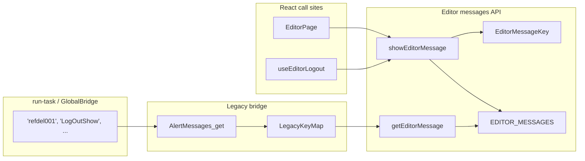

# EditorMessageKey global refactor

## Goal

Align editor alerts with the landing pattern:

| Landing (done) | Editor (target) |
|---|---|
| [`landingMessageKeys.js`](src/features/landing/messages/landingMessageKeys.js) | `editorMessageKeys.js` |
| [`landingMessages.js`](src/features/landing/messages/landingMessages.js) uses `[LandingMessageKey.X]` | [`editorMessageStore.js`](src/features/editor/messages/editorMessageStore.js) uses `[EditorMessageKey.X]` |
| Call sites use `LandingMessageKey.SESSION_OUT` | Call sites use `EditorMessageKey.LOG_OUT_SHOW` |
| Key value is clean SCREAMING_SNAKE (`'SESSION_OUT'`) | Key value is clean SCREAMING_SNAKE (`'LOG_OUT_SHOW'`) |

You chose **rename stored keys** to clean values (not alias-only). Legacy editor bundles still call `AlertMessages.get('refdel001')` etc., so a **legacy → new key map** in the bridge is required for compatibility.

## Current state

- **172** messages in [`editorMessageStore.js`](src/features/editor/messages/editorMessageStore.js) keyed by inconsistent legacy strings (`refdel001`, `LogOutShow`, `Link_Opened`, `SIGN_OFF`, …).
- React API in [`editorMessages.js`](src/features/editor/messages/editorMessages.js): `getEditorMessage` / `showEditorMessage` accept raw strings.
- **3 React call sites** with string literals:
  - [`EditorPage.jsx`](src/features/editor/pages/EditorPage.jsx): `'Link_Opened'`
  - [`useEditorLogout.js`](src/features/editor/hooks/useEditorLogout.js): `'LogOutShow'`, `'ErrorImpact'`
- Legacy bridge: [`registerEditorAlertBridge.js`](src/features/editor/messages/registerEditorAlertBridge.js) exposes `window.AlertMessages.get(key)` used by [`GlobalBridge.js`](src/services/bridge/GlobalBridge.js) and `run-task/current/_initalLoadingDialog.js`.

## Architecture



## Implementation steps

### 1. Add codegen script (one-time, kept in repo)

Create [`scripts/generate-editor-message-keys.mjs`](scripts/generate-editor-message-keys.mjs) that:

1. Reads current keys from `editorMessageStore.js` (or parses the object).
2. Converts each legacy key → clean `SCREAMING_SNAKE` constant name **and** value using rules:
   - `camelCase` / `PascalCase` → insert `_` before capitals (`LogOutShow` → `LOG_OUT_SHOW`)
   - Letter/digit boundary (`refdel001` → `REFDEL_001`, `authorDelete001` → `AUTHOR_DELETE_001`)
   - Existing underscores preserved (`SIGN_OFF` → `SIGN_OFF`, `Link_Opened` → `LINK_OPENED`)
   - Collapse duplicate `_`; assert **zero collisions** across 172 keys
3. Emits two files:
   - [`src/features/editor/messages/editorMessageKeys.js`](src/features/editor/messages/editorMessageKeys.js)
   - [`src/features/editor/messages/editorMessageLegacyKeyMap.js`](src/features/editor/messages/editorMessageLegacyKeyMap.js) — `{ [legacyKey]: EditorMessageKey.NEW_KEY }`

Manual review pass for a few high-visibility names (optional tweaks in generated output):
- `LogOutShow` → `LOG_OUT_SHOW`
- `Link_Opened` → `LINK_OPENED`
- `ErrorImpact` → `ERROR_IMPACT`
- `idle_session_alert` → `IDLE_SESSION_ALERT`

### 2. Refactor the message catalog

Update [`editorMessageStore.js`](src/features/editor/messages/editorMessageStore.js):

- Import `EditorMessageKey`.
- Replace every `'legacyKey': {` with `[EditorMessageKey.CLEAN_KEY]: Object.freeze({` (match landing freeze style).
- Export remains `EDITOR_MESSAGES`; keys are now clean strings only.

Example target shape:

```js
import { EditorMessageKey } from './editorMessageKeys.js';

export const EDITOR_MESSAGES = Object.freeze({
  [EditorMessageKey.LOG_OUT_SHOW]: Object.freeze({
    type: 'warning',
    title: 'Log out?',
    // ...
  }),
  // ...172 entries
});
```

Run the same script (or a companion rewrite step) to bulk-rekey the catalog object.

### 3. Resolve keys in the API layer

Update [`editorMessages.js`](src/features/editor/messages/editorMessages.js):

- Import `resolveEditorMessageKey` from legacy map module.
- At top of `getEditorMessage` / `showEditorMessage`:

```js
const resolvedKey = resolveEditorMessageKey(key);
const entry = EDITOR_MESSAGES[resolvedKey];
```

- Export `EditorMessageKey` (like landing exports `LandingMessageKey`).
- JSDoc: prefer `EditorMessageKey.*`; raw strings accepted only for legacy bridge input.

Add `resolveEditorMessageKey` in legacy map module:

```js
export function resolveEditorMessageKey(key) {
  return EDITOR_MESSAGE_LEGACY_KEY_MAP[key] ?? key;
}
```

### 4. Update legacy bridge

[`registerEditorAlertBridge.js`](src/features/editor/messages/registerEditorAlertBridge.js):

- `get(key)` → `getEditorMessage(resolveEditorMessageKey(key))` (resolution already in getter, or explicit here).
- `getAll()` → returns catalog keyed by **new** clean keys (document this; legacy code that iterates all keys is rare).

`window.ALERT_MESSAGE` snapshot should use `getAllEditorMessages()` so it reflects new keys.

### 5. Update React call sites and exports

| File | Change |
|------|--------|
| [`EditorPage.jsx`](src/features/editor/pages/EditorPage.jsx) | `showEditorMessage(EditorMessageKey.LINK_OPENED)` |
| [`useEditorLogout.js`](src/features/editor/hooks/useEditorLogout.js) | `EditorMessageKey.LOG_OUT_SHOW`, `EditorMessageKey.ERROR_IMPACT` |
| [`index.js`](src/features/editor/messages/index.js) | `export { EditorMessageKey }` |

### 6. Tests

Update [`tests/unit/editor/editorMessages.test.js`](tests/unit/editor/editorMessages.test.js):

- Use `EditorMessageKey.REFDEL_001` (or generated name) instead of `'refdel001'`.
- Use `EditorMessageKey.SIGN_OFF` for interpolation test.
- Add case: `getEditorMessage('refdel001')` still resolves via legacy map.
- Bridge test: `AlertMessages.get('SIGN_OFF')` and `AlertMessages.get('LogOutShow')` both return entries.

Add small unit test for [`editorMessageLegacyKeyMap.js`](src/features/editor/messages/editorMessageLegacyKeyMap.js): every legacy key maps to a key present in `EDITOR_MESSAGES`.

### 7. Documentation (minimal)

Add a short note to [`src/features/editor/messages/editorMessages.js`](src/features/editor/messages/editorMessages.js) header or editor feature README:

- Use `EditorMessageKey` in React code (never raw strings).
- Legacy keys are supported only through `resolveEditorMessageKey` / bridge.
- Do not import `EDITOR_MESSAGES` outside the messages module (same rule as landing).

## Out of scope

- Rewriting [`run-task/current/_initialAlertmessageLoader.js`](run-task/current/_initialAlertmessageLoader.js) (separate legacy bundle; bridge map covers runtime).
- Renaming message **content** or fixing typos like `GenaratePDF` (keys only).
- ESLint `no-restricted-syntax` for raw editor message strings (optional follow-up).

## Risk / mitigation

| Risk | Mitigation |
|------|------------|
| Legacy editor calls old key strings | `editorMessageLegacyKeyMap.js` + `resolveEditorMessageKey` |
| 172-key manual edit errors | Codegen script + collision check + unit test that legacy map is complete |
| `getAll()` consumers expect old keys | Bridge returns new keys; legacy map is lookup-only |

## Verification

```bash
npm run test:unit -- tests/unit/editor/editorMessages.test.js
npm run test:e2e:landing   # smoke (logout flow uses editor messages indirectly if covered)
```

Manual: open editor, trigger logout confirm dialog, duplicate-tab `Link_Opened` path.
