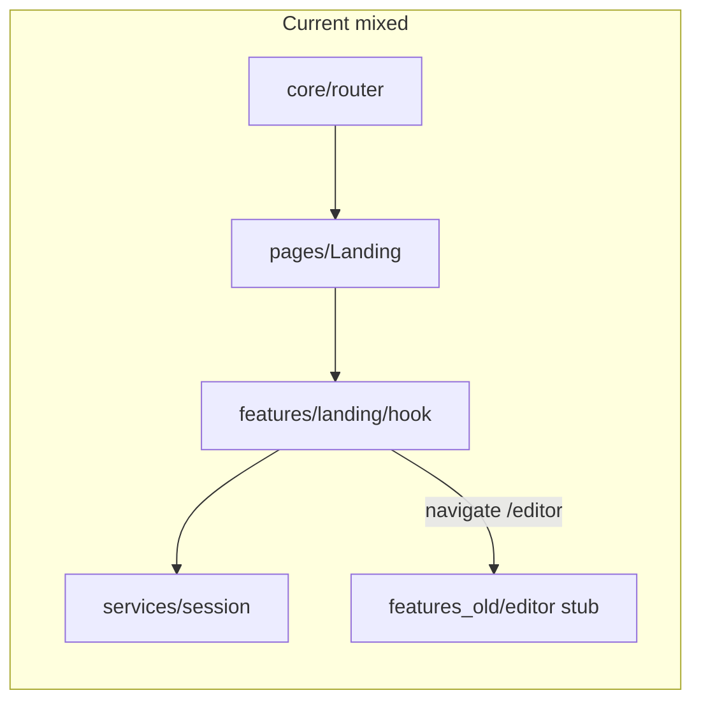

# Code Review + MVC Structure Suggestions

## Code review findings (severity order)

Do **not** treat these as “implement now” unless you ask — this section is review output.

### Critical / High

1. **Incomplete session commit vs legacy editor** — [`src/services/session/sessionStorage.js`](src/services/session/sessionStorage.js) only writes `sessionid`, `docid`, `redirect`. Legacy also set apikey, shared keys, username/role/collab in `localStorage`. Editor cannot boot from the new commit alone.
2. **`/editor` is a stub** — [`AppRouter.jsx`](src/core/router/AppRouter.jsx) routes to [`features_old/editor/pages/EditorPage.jsx`](src/features_old/editor/pages/EditorPage.jsx). Real editor lives at [`src/pages/EditorPage.jsx`](src/pages/EditorPage.jsx). Grant → navigate is a dead end.
3. **`verify_failed` shown as blocked** — [`useLandingSessionFlow.js`](src/features/landing/useLandingSessionFlow.js) treats verify mismatch like “another session” and offers Send Request.
4. **Validate payload stored before grant** — [`Landing.jsx`](src/pages/Landing.jsx) calls `setValidateResponse` on URL validity success; secrets may land in `sessionStorage` before handshake.
5. **`enableCollabBypass` unused** — flag in [`sessionConfig.js`](src/services/session/sessionConfig.js); `r:0` always blocks.
6. **PLOS captcha is client demo only** — [`ValidateUrlLanding.jsx`](src/pages/ValidateUrlLanding.jsx).
7. **Unsanitized branding HTML** — `dangerouslySetInnerHTML` for welcome/branding.

### Medium

- `docData.title` / `doi` not normalized → UI fields empty
- Waiting UI is one sleep (no countdown / unmount abort)
- `minutesSince` invalid timestamps fail closed into permanent “try again”
- `Landing.jsx` mixes marketing + validate controller (~650 lines)

### Missing tests

- Validate routing modes in `Landing.jsx`
- `sessionStorage` commit key shapes
- `verify_failed` / stale cleanup / deny after poll in hook+gateway
- No sanitization / captcha contract tests

### What looks solid

- [`src/services/session/`](src/services/session/) payloads/gateway/config layering
- Normalize + assert for validate responses
- Hook → gateway CTA orchestration (happy/block paths covered by unit tests)

---

## Current structure vs true MVC

This is a **partial feature hybrid**, not classic server MVC:

| Role | Today | Issue |
|------|--------|--------|
| Model | `services/`, `config/` | Good for API/session; editor bootstrap incomplete |
| View | `pages/`, `components/`, `modules/` | Domain UI scattered |
| Controller | Router + contexts + hooks | Landing controller split across page + hook |

**Gold standard already in repo:** [`src/features/dashboard/`](src/features/dashboard/) (`pages`, `layout`, `routes`, `context`, `utils`).

**Debt:** `features_old` still routed; `features/editor` stub broken; reports/history/activity still in `modules/`; ConfigManager/DocFinder under `components/`; duplicate layouts (`core/layout` vs `components/layout`).



---

## Recommended target: Feature-MVC hybrid (not flat models/views/controllers)

Classic root `models/`, `views/`, `controllers/` fights React and this codebase. Use **feature modules with MVC roles inside each feature**, shared model in `services/`, shared UI kit in `components/`.

```
src/
  core/                 # app shell (router, providers, global layout)
  features/
    landing/
      pages/            # ValidateUrlPage, LandingUI (Controller page + View)
      hooks/            # useLandingSessionFlow (Controller)
      routes/
    dashboard/          # keep as-is
    editor/
      pages/ components/ hooks/ services/ routes/
    auth/
    reports/ history/ activity/
    config-manager/ doc-finder/
  components/           # shared View primitives only (ui, form, table, loading)
  services/             # shared Model (api, session, supabase)
  config/ utils/ styles/
```

Inside a feature, map MVC as:

- **Model** → `services/` (feature-local or shared)
- **View** → `pages/` + `components/`
- **Controller** → `hooks/` + `routes/` + thin page containers

### Concrete landing rename (keeps URLs stable)

| Current | Target |
|---------|--------|
| `pages/Landing.jsx` validate mode | `features/landing/pages/ValidateUrlPage.jsx` |
| `pages/ValidateUrlLanding.jsx` | `features/landing/pages/LandingUI.jsx` |
| `features/landing/useLandingSessionFlow.js` | `features/landing/hooks/useLandingSessionFlow.js` |
| Routes | Stay `/validateurl`, `/validateurl/:client` |

---

## Migration mapping (high impact first)

1. **Landing** — move pages next to existing hook (already half done).
2. **Editor** — point router to real editor; retire `features_old` and broken `features/editor` stub; align session commit keys with editor bootstrap.
3. **Auth** — `pages/Login.jsx` → `features/auth/pages/`.
4. **ConfigManager / DocFinder** — promote from `components/` → features.
5. **Reports / history / activity** — `modules/*` → `features/*`; keep ModuleManager/overlay either under `features/editor` or `core/overlays`.
6. **Thin `components/`** — only shared UI; delete/quarantine `features/extras` after import audit.
7. **Providers** — move global `context/` → `core/providers/`; keep feature-local context under the feature.

---

## Suggested improvement phases

### Phase A — Fix correctness (session E2E)
- Align `commitSessionForEditor` with editor expectations (or update editor to new keys)
- Wire real `/editor` page + session bootstrap
- Split `verify_failed` UX; implement or remove collab bypass
- Defer/minimize pre-grant persistence; sanitize branding HTML; real captcha or remove demo gate
- Expand unit tests for status matrix + storage keys

### Phase B — Landing feature MVC
- Split `Landing.jsx` into ValidateUrl controller page + marketing entry if needed
- Colocate under `features/landing/{pages,hooks,routes}`
- Keep URLs unchanged

### Phase C — Project-wide feature folders
- Promote ConfigManager, DocFinder, reports/history/activity
- Retire `features_old` / `extras`
- Dedupe layouts; update `docs/FOLDER_STRUCTURE.md` to match reality

### Phase D — Harden shared Model
- Thin HTTP client; feature services call it
- One source of truth for storage keys and process constants (already started in `sessionConstants`)

---

## Standards to enforce going forward

- New domain UI goes in `features/<name>/`, never new domain folders under root `components/`
- Shared API transport stays in [`apiService.js`](src/services/api/apiService.js); feature payloads/adapters live next to the feature or in `services/<domain>/`
- Routes stay stable for email links (`/validateurl`, `/editor`)
- Each feature exports a `routes` module consumed by [`AppRouter.jsx`](src/core/router/AppRouter.jsx)
- Unit tests live under `tests/unit/<feature-or-service>/` mirroring structure

---

## Out of scope for this review doc

- Implementing the MVC move or session bugfixes (needs an explicit “implement” request)
- Editing the attached MVP plan file
