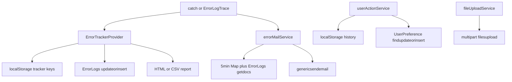

# Error/ops contract parity — impactweb → impact_react_vite

**Date:** 2026-08-24  
**Status:** Approved 2026-08-24 (implementation plan next; no application code in this file)  
**Parity bar:** Contract parity — same APIs, payloads, localStorage keys, mail HTML, and `window.ErrorLogTrace`. Internals are ES modules. Stack text comes from `Error.stack`, not `fn.caller`.

## 1. Purpose

Port four impactweb modules into React so operators and backends see the same `ErrorLogs` rows, error mail, `UserPreference` action history, and multipart uploads as today.

| impactweb file | Role |
|---|---|
| `impactweb/src/js/dialogModules/ErrorMail_Module.js` | `window.ErrorLogTrace`, 5-minute subject Map, ErrorLogs insert + getdocs, `genericsendemail` |
| `impactweb/src/modules/components/Error_Report_Table_Builder.js` | Module error store, HTML/CSV report, ErrorLogs insert from the tracker |
| `impactweb/src/modules/components/UserActionRecord_Handler.js` | Dialog/tour/find/replace/attachment history; localStorage + UserPreference |
| `impactweb/src/modules/components/FileUploadModule.js` | Multipart upload, 100/500 MB gates, `file_sn`/`file_on`/`ext` sanitize, in-flight reuse |

React already exposes `updateorinsert`, `getdocs`, `getadmindocs`, `findupdateorinsert`, `genericsendemail`, `filesupload`, `filesuploadmultiple` on `src/services/api/apiService.js`. Overlay already imports `ErrorTrackerProvider`, `ErrorBoundary`, `ErrorPanel` from `src/error/`, but that folder is README-only. `src/services/download/` is the port template: singleton, `initDownloadService()`, thin window bridge.

Landing (`ValidateUrlPage`) and editor (`EditorPage`) already call `initDownloadService()`. Error ops boots the same way.

## 2. Match vs do not copy

**Must match**

- Collection names, find/update field names, and REST paths in §4.
- Mail HTML from `GET_MAIL_TABLE_FORMAT` / `ERROR_ON_ERROR_MAIL` (structure, labels, inline colors).
- Report HTML/CSV from `ErrorReportRenderer` / `renderErrorReportTable`.
- localStorage keys in §5 (tracker persist uses the unified rule in §5.2).
- Dedup: 5-minute subject Map; 5-minute `visitData_*` for meta-errors; ErrorLogs age 10 minutes / OneTime+3 days; QUERY_SPAN family skip.
- Upload 100 MB per file / 500 MB total; in-flight promise reuse; attachment sanitize.
- `window.ErrorLogTrace(errModule, errMessage)` for leftover HTML.

**Must not copy**

- `traceOrder` walking `.caller` / `arguments.callee`.
- `String.prototype.replaceAllSplit` — use `split`/`join` or `replaceAll`.
- New tracker instance per dialog. Overlay already assumes one `ErrorTrackerProvider`.
- Bare `GET_JSON` / `GET_SENDER_RECEIVER_ID` globals. Same field bags via session + mail-config helpers.

**Stack traces (one interpretation)**

- `const stack = new Error().stack || ''`.
- Mail HTML: prefix `{errModule} Stack:`, replace `at ` with `<br>at `, collapse doubled `<br>` (same visual role as `replaceAllSplit`).
- Reports: sanitize stack (trim, cap frames like `sanitizeStack`) and a short `track` string from the first five frame names. Do not require byte-identical strings vs impactweb caller-walks.

**Window export (one interpretation)**

Legacy and React `EditorInitService.handleTimeout` both use `window.ErrorLogTrace`. After `initErrorOps()`, assign that name only (same spelling). Do not invent a second global.

## 3. Layout (implementation later)

| React path | Owns |
|---|---|
| `src/services/error/` | Mail compose, ErrorLogs read/write, subject Map, `ErrorLogTrace` bridge, `initErrorOps()` |
| `src/error/` | `ErrorTrackerProvider`, `useErrorTracker`, `ErrorBoundary`, `ErrorPanel` |
| `src/services/user-action/` | History singleton, localStorage, UserPreference, keepalive unload |
| `src/services/upload/` | File upload class (multipart, limits, sanitize) |

Rejected: one `src/services/ops/` bag (overlay stubs stay empty). Rejected: editor-feature-only (landing Validate URL mail and later figures/query upload would re-import).

Boot: `initErrorOps()` from `EditorPage` and `ValidateUrlPage`, beside `initDownloadService()`.



## 4. HTTP contracts

Use `API_ENDPOINTS` on `apiService.js`. Do not add a second HTTP client.

| Legacy | React `API_ENDPOINTS` | Body |
|---|---|---|
| ErrorLogs insert (`ErrorShareMail` and tracker `updateDB`) | `UPDATE_INSERT` → `updateorinsert` | `tbl: "ErrorLogs"`. Mail path: `docid`, `module`, `iversion`, `domain`, `function`, `errormsg`, `_r`/`_w` then merge `GET_JSON("default")` equivalent. Tracker path also: `stack`, `track`, `repeatCount`, `timestamp`. |
| ErrorLogs lookup | `GET_DOCS` → `getdocs` | `tbl: "ErrorLogs"`, `find: { module, docid, username, errormsg }`, `length: 10`, `filter: ["docid","module","username","client","projectname","errormsg","function","iversion","domain"]`. Delete `find.username` when module matches `/QUERY_SPAN\|ORG_QUERY_SPAN/i`. |
| Send mail | `GENERIC_SEND_MAIL` → `genericsendemail` | `tbl: "emaildraft"`, `emailfrom`, `emailto`, `emailBCC` (normal path only), `emailSubject`, `emailMessage`, `docid`, `find: { id: <template> }` |
| User action fetch | `GET_ADMINDOCS` → `getadmindocs` | `tbl: "UserPreference"`, `find: { recordtype: "user_action_history", username, docid, rolename, session_id }` |
| User action upsert | `FIND_UPDATE_INSERT` → `findupdateorinsert` (guided tour `record_info` uses `UPDATE_INSERT`) | Same `find`; `update: { recordtype, history, ...GET_JSON("default_main") equivalent }` |
| Upload | `UPLOAD_SINGLE` / `UPLOAD_MULTI` / `SUPPL_UPLOAD_MULTI` | `FormData`: files `file_${i}`, `tbl: "Usernotes"`, session defaults without `_w`/`_r`, `optional: 1`, `status: "0"`, arrays `file_sn`, `file_on`, `ext` |

**Mail template ids:** copy `find.id` from `ErrorMail_Module.js` for the two paths (`ErrorShareMail` vs `ErrorLogTrace` meta-error). Do not invent a third id.

**From/to/bcc:** port `GET_SENDER_RECEIVER_ID('Error_Mail')` — `MAIL_DETAIL.Error_Mail.from.default`, `to.live` vs `to.default`, `bcc.live` vs `bcc.default`, selected by `IS_LIVE_DOMAIN`. Keep values encoded in config; decode with `atob` at runtime. Do not hard-code decoded addresses in feature code.

Legacy meta-error path uses `tbl: "emaildraft"` (no `BCC`). React uses `emaildraft` for **both** paths so support filters one collection; omit `emailBCC` on the meta-error path.

## 5. localStorage (one interpretation)

### 5.1 Error mail subject Map

- Key: `xmleditor:{DOC_ID}:ErrorList` (legacy `ErrorListLocal`).
- Value: `JSON.stringify([...map.entries()])` — subject → timestamp (ms).
- Cap 5 entries; delete the oldest key when size &gt; 5.
- Skip send when (last key === this subject AND age &lt; 5 minutes) OR (Map has this subject AND age &lt; 5 minutes).

### 5.2 Tracker persist

Legacy **load** uses `global_error_tracking_{docid}`; **save** uses `global_error_tracking` with no docid. React does not copy that split.

- **Read and write** `global_error_tracking_{docid}` (`docid` from the query string).
- On init, if the scoped key is empty, **copy once** from unscoped `global_error_tracking`, then never write the unscoped key.
- Caps: 100 errors per module, 5000 global.
- Ignore module `system`; functions `lazyInitialization`, `initialization_failed`, `initializeModule`, `loadModuleClass`, `loadModuleImmediately`, `loadModuleInstance`, `registerModule`; messages matching `/ref_form/i` or `/loadModuleClass/i`.

### 5.3 Meta-error visit throttle

When `ErrorLogTrace` hits a mail-internal module or `SHARED_KEY == null`:

- Key: `visitData_` + `decodeURIComponent(location.search.substring(1))`.
- Value: `{ count, lastVisit }`. Window **5 minutes** (`5 * 60000` in source; comment says “one minute” — implement 5 minutes).
- If `count > 1` inside the window, do not send `Error_Mail_ERROR`.

### 5.4 User action history

- Key: `xmleditor:user_action_history:{docid}` (`docid` from `URLSearchParams`; if missing, suffix `no-docid` and retry load after 2s).
- If serialized size &gt; ~4.5 MB, keep newest 80% per channel; on `QuotaExceededError`, keep 50% and retry.

**Canonical write keys** (from `createEmptyHistory`): `open_close_dialog` (object: dialog id → entries), `query_quick_answer`, `insert_symbol`, `video_tour`, `guided_tour`, `find_words`, `replace_words`, `attachments_flow` (arrays).

**Read aliases** (fold on load/merge): `open_close_dialog` → `open_close_dialog`; `query_quick_answer` → `query_quick_answer`; `insert_symbol` → `insert_symbol`; `attachments_flow` → `attachments_flow`; `supp_file_workflow` → append into `attachments_flow`.

## 6. Behavior

### 6.1 ErrorLogTrace and ErrorShareMail

| Trigger | Gate | Action |
|---|---|---|
| `ErrorLogTrace(module, message)` | Missing/non-string `module`: console only | Build caller-style track via `Error.stack` (§2). If `module` is in `{ checkIsExistErrorLog, SEND_ERROR_MAIL, ErrorShareMail, addTeamIdsMail, mailBody, ERROR_ON_ERROR_MAIL, GET_MAIL_TABLE_FORMAT }` **or** `SHARED_KEY == null`, send meta-mail subject `Error_Mail_ERROR_{module}` after visitData throttle. Else `ErrorShareMail`. |
| Localhost and `!CanSendLocalMail` | First call returns; later returns false | No generic mail |
| Subject Map 5 min | `Repeated error on the {subject}` | No mail |
| After Map update | Always | `updateorinsert` ErrorLogs, then `getdocs` existence check |
| Existence check | Empty `data` → send. Else send only if last row age &gt; 10 minutes **and not** (module in OneTime `{ WORK_FLOW, editor_initialize_events }` and same `docid` and age ≤ 3 days). If last row module matches `QUERY_SPAN\|ORG_QUERY_SPAN\|RESTORE_QUERY`, do not send | `SEND_MAIL` only if `(CanSendLocalMail && IS_LOCAL_HOST) \|\| !IS_LOCAL_HOST` |
| After send path | If `IMPACT_SELECTION._SNAPSHOT` exists | `{ unlock: true }`; else no-op |

`Validate_URL`: user id from `SHARED_KEY.emailto` (single vs array); omit role row. Else `USER_INFO.MAIL_ID` + `USER_INFO.ROLE_NAME`. Client type Journal if `IS_JOURNAL` or `SHARED_KEY.dtd == 'JATS'`, else Book.

**Normal mail HTML** (`GET_MAIL_TABLE_FORMAT`): exactly `<p>Dear Team,</p><p>Sorry for the trouble. The file automatically sent to the Newgen Technical team for investigating the error. They will get back to you soon.</p>` then a table with rows **DOC ID**, **User Id**, **Project Name**, **Client Type**, **User Role** (omitted when `Validate_URL`), **Impact Version** (blue), UAT-only **Browser Details** (`ONE_LINE_ENV_INFO` or `Nil`), **Domain :** (maroon `#800000`), optional **Impact Trace Order** / **Error Message** / **Stack Order** (`#1000ff` / red / blueviolet 10pt).

**Meta-error HTML** (`ERROR_ON_ERROR_MAIL`): URL, Impact Trace Order, Error Message, Stack Order, then the same version/domain wrapper.

`ONE_LINE_ENV_INFO`: `{os}_{osVersion}_{browser} {version}_{screenSize}` from `browserInfo`, polled every 1.5s until defined.

### 6.2 Tracker and overlay

| Trigger | Gate | Action |
|---|---|---|
| `logError(module, fn, error, context)` | Ignore lists §5.2 | Store entry (id, en-US timestamp, message, sanitized stack/context, track, repeatCount); persist; `updateorinsert` ErrorLogs |
| `renderErrorReportTable` | No errors → `false` | Same intro paragraphs as mail + project table (Project+docid, User, Role, Version, Domain) + error table (Module, Function, Message, Trace Order, Repeat Count, Timestamp) |
| CSV | — | Timestamp, Module, Function, Message, Repeat Count, Context, Browser, User ID |
| Overlay | — | `ErrorPanel` shows that HTML. `ErrorBoundary` calls `logError` then `ErrorLogTrace` |

Do **not** port `syncWithServer` to `/api/errors/sync` (legacy short-circuits). ErrorLogs `updateorinsert` is the only remote write.

### 6.3 User action

| Trigger | Behavior |
|---|---|
| Construct | Load localStorage; `invoke("open_close_dialog")` |
| `updateActivity("open_close_dialog", update)` | Bucket by `dialog_id \|\| module_name`; open assigns next `_session`; close copies latest open `_session` |
| Fetch | `getadmindocs`; merge local vs server by timestamp; write localStorage |
| Sync | Skip if dialog map / query / insert / attachments are empty; `findupdateorinsert`; `keepalive` on unload; ignore unload `TypeError` / Failed to fetch |
| Trim | Newest 80% (or 50% on quota); fold `supp_file_workflow` into `attachments_flow` |

Call sites (figures, query, tours, every dialog) are **out of scope** for the first code plan. The service still exports `trackDialogOpenClose`, `trackAttachmentsFlow`, `trackSuppFileWorkflow`.

### 6.4 File upload

| Trigger | Behavior |
|---|---|
| `makeRequest(files, customData)` | Reuse in-flight promise if any; else POST FormData |
| One file &gt; 100 MB | Toast `upload_file_too_big`; `appendFiles` returns null |
| Total &gt; 500 MB | If `subfolder === "images"`, no toast; else toast `upload_size_big`; return null |
| Sanitize | Drop empty `file_sn`; pair `file_on` / `ext`; derive ext from sn if missing |
| HTTP error | `console.error`, return `null` |
| Localhost | Log `Object.fromEntries(formData.entries())` |

React toasts: map `upload_size_big` → existing `EditorMessageKey.UPLOAD_SIZE_BIG`. Map `upload_file_too_big` → existing `EditorMessageKey.SINGLE_UPLOAD_SIZE_ERR` (100 MB copy already in `editorMessageStore`). Do not add a third size constant.

## 7. Session defaults (`GET_JSON("default")`)

React has no `GET_JSON`. ErrorLogs merge and upload `appendCommonData` must use the **same default document bag** the editor already sends on `updateorinsert` (docid, client, projectname, username, and related `SHARED_KEY` / `USER_INFO` fields). Strip `_w` and `_r` before upload FormData. One helper, reused by error mail and upload.

User-action sync also merges `GET_JSON("default_main")` into `update`. Same helper family, `default_main` variant.

## 8. Public API (later plan)

```text
initErrorOps()
window.ErrorLogTrace(module, message)
errorMail.share(subject, track, message, stackHtml)
errorTracker.logError(module, fn, error, context)
errorTracker.renderErrorReportTable(options)
errorTracker.exportErrorReportCSV(options)
userAction.updateActivity(channel, update)
userAction.syncUserActionHistory({ keepalive })
fileUpload.makeRequest(files, customData)
```

`ErrorLogTrace` is the required window export. React modules import singletons; optional `window.getRecordUserAction` only if leftover HTML needs it.

## 9. Out of scope (first code plan)

- Wiring upload into figures / query / supplementary UIs.
- Recording every dialog open/close.
- Porting `ERROR_TEST` / `getStackTrace`.
- `/api/errors/sync`.
- Server schema or `genericsendemail` changes.
- Unrelated overlay widgets.

## 10. Tests (later plan)

Mirror `tests/unit/download/workflowDownloadService.test.js`:

- Subject Map: 5-minute skip, eviction at size 6, persist/restore `xmleditor:{id}:ErrorList`.
- ErrorLogs existence: empty → send; 10 min; OneTime+3 day; QUERY_SPAN skip.
- Tracker ignore lists, 100/module, 5000 global, scoped key + migrate from unscoped.
- History merge, alias fold, quota trim.
- FormData: 100/500 MB, sanitize, in-flight reuse.
- `ErrorLogTrace` argument guards; meta-error `visitData_`.

Stub `apiService`. No live mail or upload.

## 11. Success criteria

- Support can read ErrorLogs, UserPreference history, and error mail without a React-specific runbook.
- `EditorInitService` timeout can call `window.ErrorLogTrace` without throwing.
- Overlay imports of `ErrorTrackerProvider` / `ErrorBoundary` / `ErrorPanel` resolve.
- Landing and editor each call `initErrorOps()` once.

## 12. Sources

- `C:\_IMPACT\tomcat\webapps\impactweb\src\js\dialogModules\ErrorMail_Module.js`
- `C:\_IMPACT\tomcat\webapps\impactweb\src\modules\components\Error_Report_Table_Builder.js`
- `C:\_IMPACT\tomcat\webapps\impactweb\src\modules\components\UserActionRecord_Handler.js`
- `C:\_IMPACT\tomcat\webapps\impactweb\src\modules\components\FileUploadModule.js`
- `GET_SENDER_RECEIVER_ID` `Error_Mail` branch in `impactweb/src/js/index.js`
- `impact_react_vite/src/services/api/apiService.js`, `src/services/download/`, `src/error/`, `src/overlay-system/index.js`, `src/services/core/EditorInitService.js`
