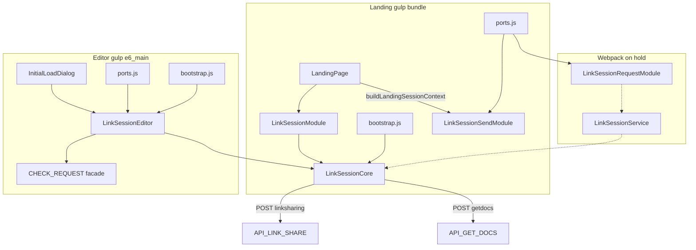

# Link Session — Core and Sub-Modules

**Audience:** Developers working on linksharing (landing login, send request, editor scheduler, accept/reject dialog).

**Priority:** Send Request on landing is **Level 1 (P0)** — any defect in that flow is a top-priority ticket.

**Related docs:**
- [API.md](./API.md) — backend `process` values and MongoDB mapping
- [docs/linksharing-frontend-backend-map.md](../../../docs/linksharing-frontend-backend-map.md) — team FE ↔ BE reference
- [link_session_send/skills.md](../link_session_send/skills.md) — send UI runbook
- [link_session_request/skills.md](../link_session_request/skills.md) — request dialog runbook

---

## Architecture



**Design principle:** Session logic lives in **one UI-free core**. UI is split into **send** (landing) and **request** (editor) sub-modules connected through **ports**.

---

## Module map

| Piece | Path | Gulp page | Role |
|-------|------|-----------|------|
| **session_landing** | `pipeline.js` PAGES | Gulp → `session_landing.js` | ports → core → module → bootstrap → send |
| **session_editor** | `pipeline.js` PAGES | Gulp → `session_editor.js` | ports → core → LinkSessionEditor → bootstrap |
| **LinkSessionService** | `index.js` | Webpack `module_main` (on hold) | Future webpack editor entry |
| **LinkSessionSendModule** | `../link_session_send/index.js` | Gulp landing only | Send Request + 45s poll Swal |
| **LinkSessionRequestModule** | `../link_session_request/index.js` | Webpack `module_main` | Accept / reject / auto-accept dialog |

**Deprecated:** `src/modules/link_share/` — do not extend; use this stack instead.

---

## LinkSessionCore

UI-free class (~1100 lines). Extended by landing wrapper and editor service; never imported as a webpack entry on its own.

### Responsibilities

| Area | Methods |
|------|---------|
| **Payload builders** | `buildPayload`, `buildCheckPayload`, `buildSendRequestPayload`, `buildUpdateReqStatusTimePayload`, `buildGetRequestStatusPayload`, `getJsonOrBuild`, … |
| **HTTP** | `postLinkShare`, `postGetDocs`, `postRequest` |
| **Landing login** | `loginFromLanding`, `handleCheckResponse`, `sendAccessRequest`, `handleUpdateReqId`, `pollRequestStatus`, `handleGetReqStatus`, `completeAccessGrant` |
| **Double-verify** | `confirmSessionOnServer`, `validateBeforeSave`, `isActiveSessionRecord` |
| **Landing state** | `captureLandingCtxState`, `mergeLandingCtxState` — persists `sessionStartTime` across bootstrap ajax callbacks |
| **Editor scheduler** | `initEditorSession`, `startScheduler`, `handleNewRequestPost`, `handleOpenNewRequestDefault`, `handleIdleCheck` |
| **Editor facade** | `createEditorFacade` → `window.CHECK_REQUEST` |
| **Redirect** | `commitStorageAndRedirect`, `redirectCurrentSession` |

### Landing flow (`loginFromLanding`)

1. `buildCheckPayload` → `POST linksharing` (`process: check`)
2. `handleCheckResponse`:
   - `r: 1` (or collab bypass) → `completeAccessGrant` → optional getdocs verify → `localStorage` + redirect
   - `r: 0` → `delegateSendPrompt` → send sub-module UI
   - `r: 2` → `ctx.onAccessDeniedWithRemarks`

### Send-request chain (P0)

1. User confirms → `sendAccessRequest` (branches on `requeststatus` / 30 min stale rules)
2. `update_reqstatus_time` or `update_docstatus_reqstatus_insert_time` → `handleUpdateReqId`
3. `showPollWaiting` (45s) → `pollRequestStatus` → `getrequeststatus_process`
4. Grant → `completeAccessGrant` with `skipVerify: true` after successful poll

### Editor scheduler

`CHECK_REQUEST.Init()` → `initEditorSession` → `timerMethod('scheduler')` every **15s** → `new_request_post` → on pending request → `open_new_request` → `openRequestDialog` (retries up to 5s).

### Constants

- `LinkSessionCore.PROCESS` — all backend `process` string values
- `LinkSessionCore.DOC_STATUS` — `ACTIVE: '1'`, `INACTIVE: '0'`
- `LinkSessionCore.REQUEST_STATUS` — `PENDING: '1'`, `ACCEPTED: '2'`, `REJECTED: '4'`

---

## ports.js

Registers UI adapters without coupling core to DOM.

```javascript
window.LinkSessionPorts = { send: null, request: null };
```

| Export | Purpose |
|--------|---------|
| `getRequestDialog(self)` | Resolve editor dialog: ports → `LinkSessionRequestDialog` → legacy `LinkShareDialog` |
| `openRequestDialog(self, options)` | Retry dialog open until `LinkSessionRequestModule` registers (default 20 × 250ms) |

Sub-modules set `LinkSessionPorts.send` / `.request` on load.

---

## bootstrap.js

Wires legacy `commonfn.*` handlers to core methods. Uses `resolveLandingSessionContext()` which merges persisted state from `captureLandingCtxState`.

| Callback | Core handler |
|----------|----------------|
| `checkaccess` | `handleCheckResponse` |
| `update_open1` | `handleUpdateOpen1` |
| `updatereq_id` | `handleUpdateReqId` |
| `getreqstatus` | `handleGetReqStatus` |
| `request_close_session` | `RE_DIRECT_CUR_SESSION` |
| `idle_session_close` | `RE_DIRECT_CUR_SESSION` |

---

## LinkSessionModule (landing)

Thin wrapper: `class LinkSessionModule extends LinkSessionCore`.

- `getInstance()` — auto-creates singleton (unlike editor service)
- Sets `window.LinkSessionModule` and `window.LinkSessionService` (alias)
- `DOMContentLoaded` — resets `_instance`, sets `RE_DIRECT_CUR_SESSION`

**Usage:**

```javascript
LinkSessionModule.getInstance().loginFromLanding(buildLandingSessionContext());
```

`buildLandingSessionContext()` in [`LandingPage.js`](../../js/dialogModules/LandingPage.js) supplies callbacks (`onTryAgain`, `onRequestError`, `onVerifyFailed`) and `ctx.ui` ports pointing at `LinkSessionSendModule`.

---

## LinkSessionService (editor)

Webpack entry [`index.js`](./index.js). Same core logic, different init:

- `getInstance()` — returns `null` until `postInitializeModule`
- `postInitializeModule` sets:
  - `window.LinkSessionService` / `window.LinkSessionModule`
  - `window.CHECK_REQUEST` = `createEditorFacade()`
  - `window.RE_DIRECT_CUR_SESSION`

**Init order** (production [`_initalLoadingDialog.js`](../../js/_initalLoadingDialog.js)):

1. `await moduleRegistry.getModule('LinkSessionService')`
2. `await moduleRegistry.getModule('LinkSessionRequestModule')`
3. `CHECK_REQUEST.Init()`
4. `new_session_check()`

`FullyLoaded` is set only after this async chain completes.

---

## LinkSessionSendModule

**Path:** [`../link_session_send/`](../link_session_send/)

| Method | UI | Next step |
|--------|-----|-----------|
| `prompt(response, ctx)` | `AlertNewDialog` `Land_Page_Send_Req` | `sendAccessRequest` on confirm |
| `showPollWaiting(ctx)` | Swal 45s timer | `pollRequestStatus` on timer expiry |

Missing `AlertNewDialog` or service → `ctx.onRequestError`.

**Bundle:** Gulp landing only (not webpack). Sources listed in [`utils/gulp/pipeline.js`](../../../utils/gulp/pipeline.js) — gulp concat builds `session_landing.js`.

**Landing** [`utils/gulp/pipeline.js`](../../../utils/gulp/pipeline.js):

`index.js` → `session_landing.js` → `landing.js` (dialogs) — see `snippet/component/page_script_landing.html`

`session_landing` page: `ports` → `LinkSessionCore` → `LinkSessionModule` → `bootstrap` → `link_session_send`

**Editor** [`utils/gulp/pipeline.js`](../../../utils/gulp/pipeline.js):

`e6_common` → `session_editor.js` → `e6_main.js` — `CHECK_REQUEST` from `LinkSessionEditor.ensureGlobals()`. Webpack on hold.

---

## LinkSessionRequestModule

**Path:** [`../link_session_request/`](../link_session_request/)

`BaseModule` dialog — template id **`LinkSessionRequestDialog`** (legacy alias: `LinkShareDialog`).

| Method | Behavior |
|--------|----------|
| `request_dialog()` | `show()` incoming-request panel |
| `showLoop()` | 30s countdown → auto-accept |
| `handleConfirmDialog('confirm')` | `updatestatus_reqstatus` docstatus `4` |
| `handleConfirmDialog('cancel')` | Swal reject → `updatereqstatus` |
| `handleDialogAutoAccept()` | `updatestatus_reqstatus` docstatus `3` |

Payloads built via `LinkSessionService.getInstance().getJsonOrBuild(...)`.

**Registration:** `module_main.js` — depends on `LinkSessionService`, template `link_session_request/template.html`.

---

## Session context (`ctx`)

Built by `buildLandingSessionContext()` or passed from editor handlers.

| Field | Purpose |
|-------|---------|
| `docId`, `sessionId`, `requestId` | Identity for payloads |
| `sessionStartTime` | Set at check; persisted via `captureLandingCtxState` |
| `grantSessionStartTime` | Set on send / poll; used in double-verify |
| `onTryAgain`, `onRequestError`, `onVerifyFailed` | Landing error UX |
| `onCommitStorage`, `onRedirect` | Grant success |
| `ui.sendPrompt`, `ui.showPollWaiting` | Ports to send module |

---

## Globals after init

| Global | Set by |
|--------|--------|
| `LinkSessionModule` / `LinkSessionService` | Landing wrapper or editor service |
| `CHECK_REQUEST` | `LinkSessionService.postInitializeModule` |
| `LinkSessionSendModule` | `link_session_send/index.js` |
| `LinkSessionRequestDialog` | `LinkSessionRequestModule.postInitializeModule` |
| `LinkSessionPorts` | `ports.js`; filled by send/request modules |
| `getRequestDialog`, `openRequestDialog` | `ports.js` |
| `confirmok` | Request module (legacy pattern) |

---

## Testing

| Suite | Command |
|-------|---------|
| Unit | `npm run test:unit` — `tests/unit/link_session/` |
| E2E | `npm run test:module:link-session` |

Key unit areas: payloads, send branches, ports retry, landing ctx state, editor init order.

---

## Troubleshooting

| Symptom | Check |
|---------|-------|
| Send Request does nothing | `LinkSessionSendModule` in landing gulp bundle; `AlertNewDialog` loaded |
| Editor never shows request dialog | `CHECK_REQUEST.Init()` called; `LinkSessionRequestModule` loaded; `openRequestDialog` retries |
| Poll uses wrong `session_start_time` | `captureLandingCtxState` after login; bootstrap uses `resolveLandingSessionContext` |
| Save blocked incorrectly | `validateBeforeSave` / getdocs; `sessionId` in sessionStorage |
| Stack overflow on send | `ctx.ui.sendPrompt` must not call `delegateSendPrompt` (fixed in `LandingPage.js`) |
