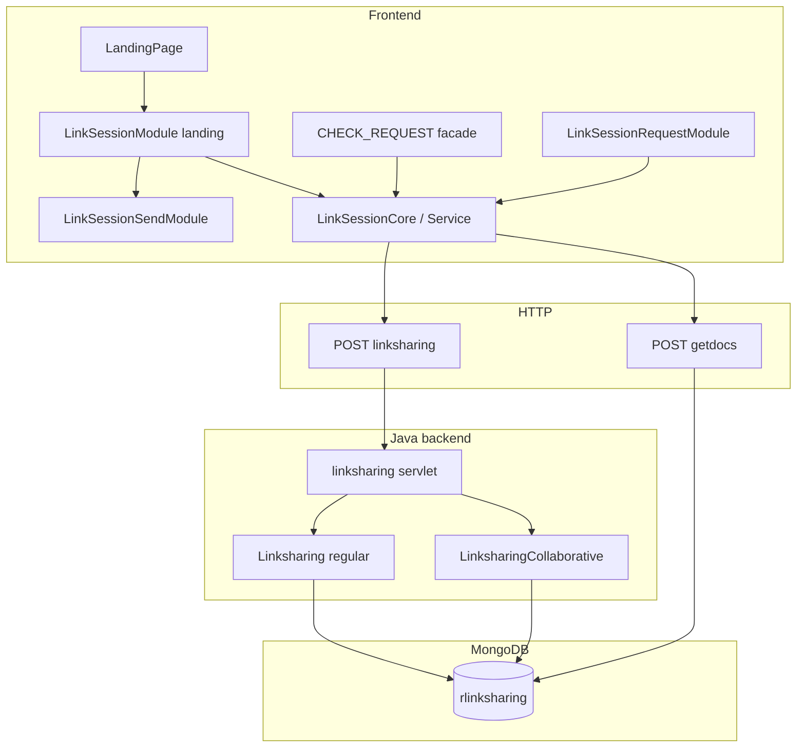
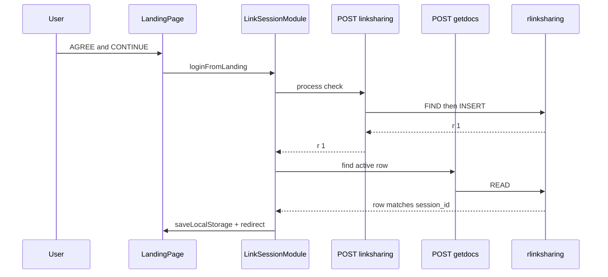
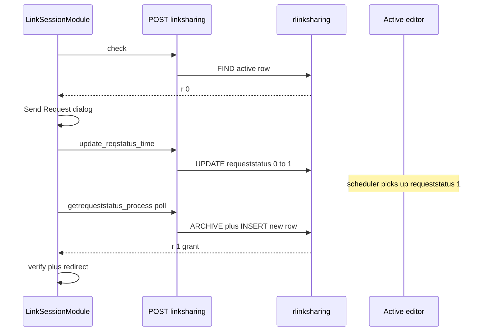
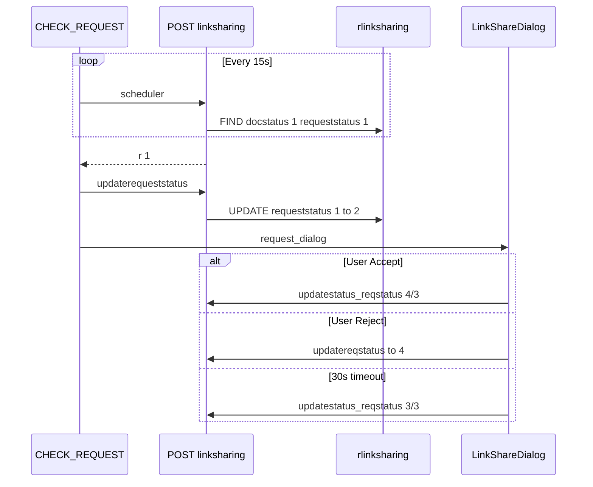

# LinkSharing — Frontend API vs Backend DB Process Map

**Audience:** Team reference — what the browser sends, what Java writes to MongoDB, what comes back, and what happens next.

**Verified against:**
- Java: [`utils/java/linksharing_mongo_db_operation.java`](../utils/java/linksharing_mongo_db_operation.java)
- Frontend core: [`src/modules/link_session/LinkSessionCore.js`](../src/modules/link_session/LinkSessionCore.js)
- Landing: [`LinkSessionModule.js`](../src/modules/link_session/LinkSessionModule.js) + [`link_session_send`](../src/modules/link_session_send/index.js)
- Editor dialog: [`link_session_request`](../src/modules/link_session_request/index.js)
- Editor service: [`link_session/index.js`](../src/modules/link_session/index.js) (`LinkSessionService`)

**Related docs:**
- Dense API reference: [`src/modules/link_session/API.md`](../src/modules/link_session/API.md)
- Module architecture: [`src/modules/link_session/MODULES.md`](../src/modules/link_session/MODULES.md)
- Landing flow detail: [`linksharing-landing-session.md`](./linksharing-landing-session.md)

---

## At a glance

### Two HTTP endpoints

| Endpoint | Global var | Writes MongoDB? | Used for |
|----------|------------|-----------------|----------|
| `POST …/linksharing` | `API_LINK_SHARE` | **Yes** (except `scheduler`) | All session `process` values |
| `POST …/getdocs` | `API_GET_DOCS` | **No** (read only) | Phase 1 double-verify before `localStorage` commit |

### Transport (both endpoints)

```
POST
Content-Type: application/x-www-form-urlencoded
Headers: appkey, apikey

Body:
  jsondata = "<stringified JSON>"
```

### MongoDB

| Item | Value |
|------|--------|
| Collection | `rlinksharing` |
| Payload table key | `"tbl": "linksharing"` |
| Servlet | `linksharing.java` → `Mongodbops.Linksharing` or `LinksharingCollaborative` |
| Routing | If payload contains `"collaborative"` → collab logic (per user/role); else → regular (per `docid`) |

### Response shape

Backend prints the inner `data` document. Primary field:

| `r` | Meaning (most processes) |
|-----|--------------------------|
| `1` | Success |
| `0` | Blocked / not found / still waiting |
| `2` | Rejected (`getrequeststatus_process` only) — read `remarks` |

---

## Architecture diagram



---

## How to read each process section

Every process below follows this pattern:

| Column | Meaning |
|--------|---------|
| **Who calls** | Frontend file / handler |
| **Frontend payload** | Key JSON fields sent in `jsondata` |
| **Backend FIND** | Mongo query filter |
| **Backend WRITE** | INSERT / UPDATE / none |
| **Response `r`** | What the browser receives |
| **Frontend next** | Handler after response |
| **DB row after** | Typical state (regular mode) |

---

## Status codes cheat sheet

### `docstatus` (session lifecycle)

| Code | Meaning | Set by |
|------|---------|--------|
| `0` | Closed / inactive | `close`, idle auto-close on `check` |
| `1` | **Active editing session** | `check` insert, `refresh` |
| `2` | Idle archival marker | `updatestatus_reqstatus` (idle path) |
| `3` | Timeout transfer | LinkShare dialog 30s auto-accept |
| `4` | Manual accept transfer | `confirmok` accept |
| `5`–`7` | Archival pairs | `getrequeststatus_process` grant paths |
| `8` | Stale session marker | `update_docstatus_reqstatus_insert_time` |

### `requeststatus` (access request)

| Code | Meaning | Set by |
|------|---------|--------|
| `0` | No active request | Default on insert |
| `1` | **Pending** — sent, awaiting editor scheduler | `update_reqstatus_time` |
| `2` | Delivered to active editor | `updaterequeststatus` |
| `3` | Resolved (handoff complete) | Accept / timeout / idle close |
| `4` | **Rejected** | `updatereqstatus` |

### Active session definition

A row is **active** when: `docstatus = "1"` AND `session_end_time = "0"`.

---

# Flow A — Landing login (happy path)



| Step | Frontend | API | `process` | Backend DB | `r` | Next |
|------|----------|-----|-----------|------------|-----|------|
| 1 | `processUserValidation` | validate API | — | — | — | Store `pendingCommitResData` (no localStorage yet) |
| 2 | `loginFromLanding` | linksharing | `check` | FIND active → **INSERT** new row | `1` | Step 3 |
| 3 | `validateBeforeSave` | getdocs | find query | **READ** only | — | Must match `session_id` + `docstatus:1` |
| 4 | `commitStorageAndRedirect` | — | — | — | — | `saveLocalStorageData` + redirect to editor |

### Example payload — step 2 (`check`)

```json
{
  "tbl": "linksharing",
  "docid": "DOC123",
  "process": "check",
  "session_id": "550e8400-e29b-41d4-a716-446655440000",
  "session_start_time": "1700000000000",
  "remarks": "login",
  "username": "author@example.com",
  "role": "1",
  "rolename": "Author"
}
```

### Example response — step 2 (grant via insert)

```json
{ "r": 1 }
```

Note: insert often returns only `{ "r": 1 }`. Client must use local `session_id` / `session_start_time` for verify.

### Example DB row after insert

| Field | Value |
|-------|--------|
| docid | DOC123 |
| docstatus | 1 |
| session_id | (client UUID) |
| session_start_time | (client ms) |
| session_end_time | 0 |
| last_saved_time | 0 |
| requeststatus | 0 |
| requestid | 0 |
| request_send_time | 0 |

---

# Flow B — Landing blocked → Send Request

Triggered when `check` returns `{ "r": 0 }` (another active session exists).



| Step | Frontend handler | `process` | Backend DB | `r` | Next |
|------|------------------|-----------|------------|-----|------|
| 1 | `handleCheckResponse` | `check` | FIND — active row exists, no insert | `0` | Send Request dialog |
| 2a | `sendAccessRequest` (first send) | `update_reqstatus_time` | **UPDATE** active row: `requeststatus 0→1`, set `requestid`, `request_send_time` | `1` | 45s wait → poll |
| 2b | `sendAccessRequest` (stale pending >30m) | `update_docstatus_reqstatus_insert_time` | **UPDATE** archive `docstatus:8`, `requeststatus:7` + **INSERT** new row | `1` | verify + redirect |
| 2c | `sendAccessRequest` (resend after reject) | `update_reqstatus_time` + `oldrequestid` | **UPDATE** row where `requeststatus:4` | `1` | poll |
| 3 | `pollRequestStatus` | `getrequeststatus_process` | FIND by `requestid`; grant = archive + insert | `1`/`0`/`2` | redirect / wait / denied |

### Example payload — first send (`update_reqstatus_time`)

```json
{
  "tbl": "linksharing",
  "docid": "DOC123",
  "process": "update_reqstatus_time",
  "requeststatus": "1",
  "request_send_time": "1700000000000",
  "requestid": "req-uuid-123"
}
```

Backend FIND: `docid + docstatus:1 + requeststatus:0 + requestid:0 + request_send_time:0`.

### Example payload — poll (`getrequeststatus_process`)

```json
{
  "tbl": "linksharing",
  "docid": "DOC123",
  "process": "getrequeststatus_process",
  "requestid": "req-uuid-123",
  "session_id": "550e8400-e29b-41d4-a716-446655440000",
  "session_start_time": "1700000000000"
}
```

| Poll `r` | Meaning | Frontend |
|----------|---------|----------|
| `1` | Granted — new active row inserted | verify + redirect |
| `0` | Still waiting or not found | Try again alert |
| `2` | Rejected | Access denied + `remarks` |

---

# Flow C — Editor session open

| Step | Caller | `process` | Backend DB | `r` |
|------|--------|-----------|------------|-----|
| 1 | `new_session_check` | `check` | FIND → INSERT or block | `1` / `0` |
| 2 | `new_session_check` (tab refresh) | `refresh` | UPDATE reopen where `session_end_time ≠ 0` | `1` |
| 3 | `CHECK_REQUEST.Init` | `update_session_end_time` | UPDATE touch `session_end_time` | `1` |

Editor payloads use `GET_JSON('linksharing', …)` in [`src/js/index.js`](../src/js/index.js) to inject `session_id` from `sessionStorage`.

---

# Flow D — Editor scheduler (active user sees request)

Runs every **~15 seconds** via `LinkSessionModule.startScheduler` → `CHECK_REQUEST`.



| Step | `process` | Backend FIND | Backend WRITE | `r` |
|------|-----------|--------------|---------------|-----|
| 1 | `scheduler` | `docstatus:1 + requeststatus:1` | **None** (read only) | `1` = request waiting |
| 2 | `updaterequeststatus` | `requeststatus:1`, `requestid≠0`, `request_send_time≠0` | UPDATE `requeststatus→2` | `1` |
| 3a Accept | `updatestatus_reqstatus` | server `requeststatus:2` | UPDATE `docstatus:4`, `requeststatus:3` | `1` |
| 3b Timeout | `updatestatus_reqstatus` | server `requeststatus:2` | UPDATE `docstatus:3`, `requeststatus:3` | `1` |
| 3c Idle close | `updatestatus_reqstatus` | server `requeststatus:2` | UPDATE `docstatus:2`, `requeststatus:3` | `1` |
| 3d Reject | `updatereqstatus` | server `requeststatus:2` + `session_id` | UPDATE `requeststatus→4`, set `remarks` | `1` |

### Example payload — scheduler

```json
{
  "tbl": "linksharing",
  "docid": "DOC123",
  "process": "scheduler",
  "docstatus": "1",
  "requeststatus": "1"
}
```

---

# Flow E — Session maintenance

| `process` | Who calls | Backend FIND | Backend WRITE |
|-----------|-----------|--------------|---------------|
| `save` | Editor autosave | `docid + docstatus:1` | SET `last_saved_time` |
| `close` | Idle logout, user exit | `docid + session_id + session_end_time:0` | SET `docstatus:0`, `session_end_time` (timestamp) |
| `refresh` | Tab reload | `docid + session_id + session_end_time≠0` | SET `docstatus:1`, `session_end_time:0` |
| `signoff` | Collab finalize only | per user/role filter | Close all rows for role |

---

# Complete process catalog

| `process` | Frontend caller | Writes DB? | Backend action (regular) |
|-----------|-----------------|------------|--------------------------|
| `check` | Landing, editor | Yes | FIND → INSERT / idle close / block |
| `update_reqstatus_time` | Landing send request | Yes | UPDATE request fields on active row |
| `update_docstatus_reqstatus_insert_time` | Landing stale cleanup | Yes | ARCHIVE + INSERT |
| `getrequeststatus_process` | Landing poll | Yes | FIND → grant (archive+insert) or reject |
| `scheduler` | Editor interval | **No** | FIND pending request |
| `updaterequeststatus` | After scheduler | Yes | Promote request `1→2` |
| `updatestatus_reqstatus` | Accept / timeout / idle | Yes | Hand off session |
| `updatereqstatus` | Reject | Yes | Set `requeststatus:4` |
| `close` | Logout | Yes | Close session row |
| `refresh` | Tab reload | Yes | Reopen closed row |
| `save` | Autosave | Yes | Update `last_saved_time` |
| `update_session_end_time` | CHECK_REQUEST init | Yes | Touch end time |
| `update_req_status` | *(unused frontend)* | Yes | Clear rejected request |
| `signoff` | Collab only | Yes | Close all role sessions |

---

# Phase 1 additions (frontend only)

These steps have **no matching `process`** in the Java linksharing servlet:

| Step | API | DB | Purpose |
|------|-----|-----|---------|
| Double-verify | `POST getdocs` | READ | Confirm active row matches client `session_id` before `localStorage` |
| Deferred storage | — | — | `validateuserpost` → `pendingCommitResData` in memory until verify passes |

---

# Regular vs collaborative

| Aspect | Regular | Collaborative |
|--------|---------|---------------|
| Scope | Per `docid` only | Per `docid` + `role` + `rolename` + `username` |
| Payload flag | *(none)* | `"collaborative": "1"` |
| Extra process | — | `signoff` |
| Verified aligned? | **Yes** | **No** — collab scheduler filters differ from regular; see API.md quirks |

---

# Known quirks

1. **`check` idle close** sets `docstatus:"0"` but keeps `session_end_time:"0"` — not a true “closed with timestamp” row.
2. **`check` insert** returns minimal `{ "r": 1 }` — always verify with client session IDs.
3. **`check` idle + `last_saved_time:"0"`** (regular only) can return `{ "r": 1 }` without insert — double-verify blocks false grants.
4. **`requeststatus: 4`** means **rejected**, not expired.
5. **Collab** `updaterequeststatus` filters conflict with regular — test collab separately.

---

# Frontend module map

| Flow | Module / handler |
|------|-------------------|
| Landing login | `LinkSessionModule.loginFromLanding` (landing wrapper) |
| Check response | `LinkSessionCore.handleCheckResponse` |
| Send request UI (P0) | `LinkSessionSendModule.prompt` via `ctx.ui.sendPrompt` |
| Send request API | `LinkSessionCore.sendAccessRequest` |
| Poll waiting UI (P0) | `LinkSessionSendModule.showPollWaiting` via `ctx.ui.showPollWaiting` |
| Poll approval | `LinkSessionCore.pollRequestStatus` / `handleGetReqStatus` |
| Double-verify | `LinkSessionCore.validateBeforeSave` / `confirmSessionOnServer` |
| Storage commit | `LinkSessionCore.commitStorageAndRedirect` |
| Editor scheduler | `LinkSessionService.startScheduler` / `handleNewRequestPost` |
| Accept/reject dialog | `LinkSessionRequestModule` → `confirmok` |
| Build any payload | `LinkSessionCore.buildPayload(process, ctx)` or `getJsonOrBuild` |

**Bundles:**
- **Landing:** gulp `session_landing.js` — `ports` → `LinkSessionCore` → `LinkSessionModule` → `bootstrap` → `link_session_send` (loaded after `index.js`, before `landing.js`)
- **Editor:** gulp `session_editor.js` — `ports` → `LinkSessionCore` → `LinkSessionEditor` → `bootstrap` (loaded between `e6_common.js` and `e6_main.js`; sets `CHECK_REQUEST` at load time)
- **Editor dialog (webpack):** `LinkSessionRequestModule` via `moduleRegistry` — accept/reject dialog only
- **Webpack `LinkSessionService` entry:** on hold; gulp `session_editor.js` is the current production path

**Globals:** Landing `window.LinkSessionModule`; editor `window.LinkSessionService`, `window.CHECK_REQUEST`, `window.LinkSessionRequestDialog`.
