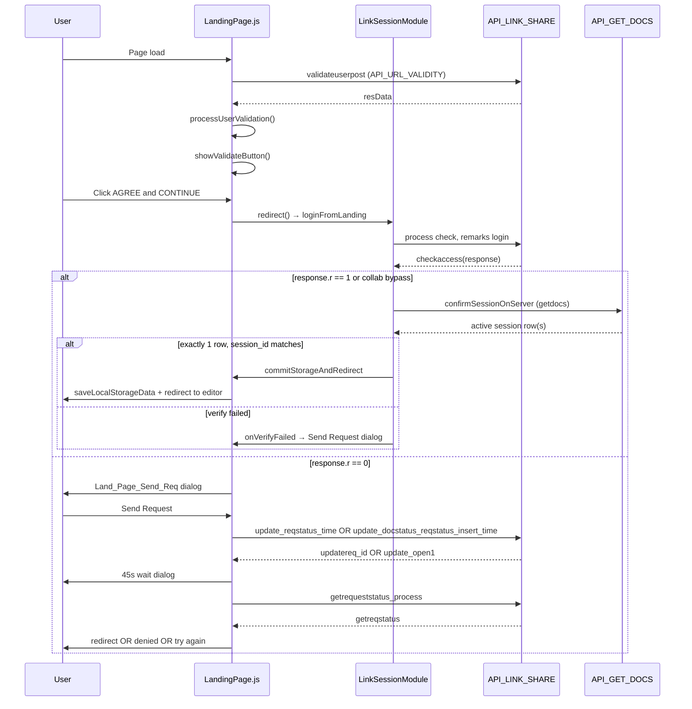
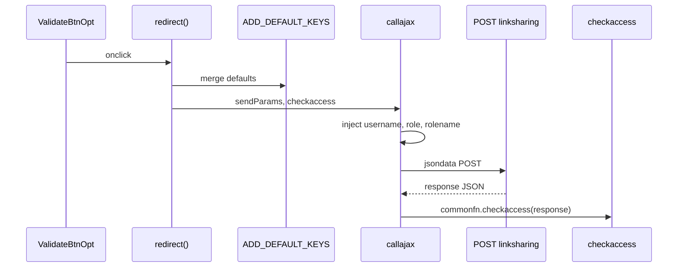
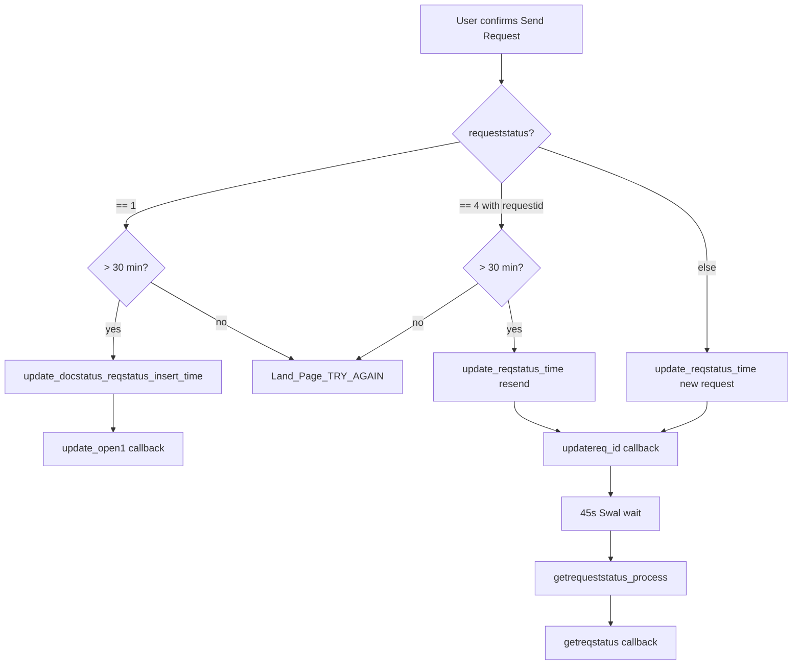
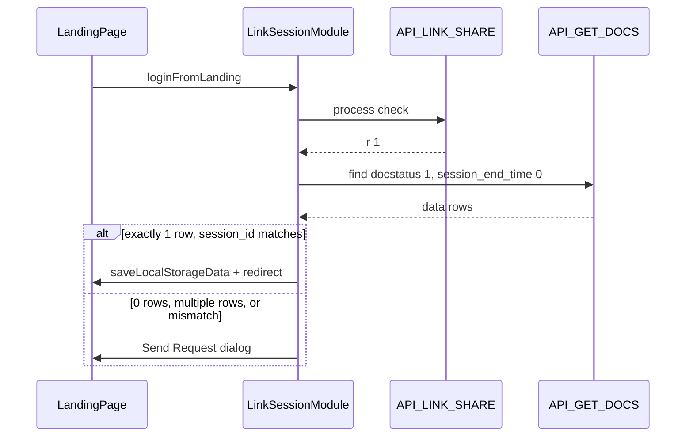

# LinkSharing — Landing Page Session Flow

This document describes the landing-page session access flow in `src/js/dialogModules/LandingPage.js`: the **check** process (`checkaccess`) and the **Send Request** recovery path.

**Audience:** Team reference for raw request payloads, API responses, and inferred database state.

**Related docs:** [validateSessionBeforeSave.md](./validateSessionBeforeSave.md) (editor save-time session validation)

**Source files:**

| File | Role |
|------|------|
| `src/js/dialogModules/LandingPage.js` | `redirect()`, `checkaccess`, Send Request handlers |
| `src/modules/link_session/LinkSessionCore.js` | Session core — check, grant, getdocs verify, redirect |
| `src/modules/link_session/LinkSessionModule.js` | Landing wrapper — `loginFromLanding`, `window.LinkSessionModule` |
| `src/js/index.js` | `ADD_DEFAULT_KEYS`, `API_LINK_SHARE`, `API_GET_DOCS`, `GET_JSON` |
| `src/js/editor_page_events_fn.js` | Editor `new_session_check` / `new_session_post` |
| `src/js/dialogModules/LinkShare_CheckRequest_Module.js` | In-editor request dialog (active user side) |

> **Team process map (FE API ↔ backend DB):** [`linksharing-frontend-backend-map.md`](./linksharing-frontend-backend-map.md) — step-by-step tables for each `process`.
>
> **Authoritative backend reference:** [`src/modules/link_session/API.md`](../src/modules/link_session/API.md) (from `Mongodbops.Linksharing` in Java API v3). Status tables in this doc are being aligned — prefer API.md for `docstatus`/`requeststatus` and all 14 `process` values.

---

## End-to-end flow



> **Note:** Poll-approved grants (`getreqstatus r==1`) skip getdocs verify (`skipVerify: true`). See [Double-verify flow (implemented)](#double-verify-flow-implemented) for full details.

---

## HTTP transport (all linksharing calls)

```
POST {API_PATH}linksharing
Content-Type: application/x-www-form-urlencoded
Headers: appkey, apikey

Body:
  jsondata = "<stringified JSON>"
```

Callback routing: `commonfn.callajax(jsondata, '<postfun>', API_LINK_SHARE)` dispatches to `commonfn.<postfun>(response)`.

---

## Collection schema (inferred)

Collection name used in tests/config: `rlinksharing` (API table key: `linksharing`).

| Field | Type (inferred) | Description |
|-------|-----------------|-------------|
| `docid` | string | Document identifier |
| `docstatus` | string code | Session lifecycle state |
| `session_id` | string | Active session owner ID |
| `session_start_time` | ms string | Session opened timestamp |
| `session_end_time` | ms string / `"0"` | Session closed; `"0"` = still open |
| `last_saved_time` | ms string | Last editor save timestamp |
| `remarks` | string | Context: `login`, reject reason, etc. |
| `requeststatus` | string code | Access-request state |
| `request_send_time` | ms string | When access request was sent |
| `requestid` | string | Client-generated request correlation ID |
| `username` | string | Active or requesting user email |
| `role` | string | Role ID |
| `rolename` | string | Role display name |
| `tabid` | string | Browser tab ID (editor sends; landing does not today) |

### `docstatus` codes (inferred)

| Code | Meaning (inferred) | Typical setter |
|------|-------------------|----------------|
| `1` | Active editing session | `process: check` success |
| `2` | Idle / auto-closed | `updatestatus_reqstatus` idle path |
| `3` | Session transferred (timeout) | LinkShare dialog 30s auto-accept |
| `4` | Session transferred (user accepted) | `confirmok('confirm')` in editor |
| `8` | Stale session marker | `update_docstatus_reqstatus_insert_time` |

### `requeststatus` codes (inferred)

| Code | Meaning (inferred) | Typical setter |
|------|-------------------|----------------|
| `1` | Request pending / sent | New request from landing |
| `2` | Request delivered to active editor | `updaterequeststatus` (scheduler) |
| `3` | Request closed / resolved | Accept, reject, idle close |
| `4` | Prior request expired | `updatereqstatus` |
| `7` | Stale request superseded | Stale cleanup branch |

---

# Part 1 — `checkaccess` (`process: "check"`)

## Trigger

| Step | Location | Action |
|------|----------|--------|
| User | `#ValidateBtnOpt` onclick | Calls `redirect()` |
| Build | `redirect()` L993–1009 | JSON + `ADD_DEFAULT_KEYS` |
| Send | `commonfn.callajax` | POST to `API_LINK_SHARE`, callback `checkaccess` |



## Request payload

### Base (from `redirect()`)

```json
{
  "tbl": "linksharing",
  "docid": "<DOC_ID>",
  "session_id": "<NEW_SESSION_ID>",
  "session_start_time": "<Date.now() ms string>",
  "process": "check",
  "remarks": "login"
}
```

- `NEW_SESSION_ID` — client-generated 8-digit integer (`Math.floor(10000000 + Math.random() * 90000000)`).
- `session_id` is excluded from `ADD_DEFAULT_KEYS` then explicitly set to `NEW_SESSION_ID`.

### Fields added by `ADD_DEFAULT_KEYS("defaults", {}, [], ['session_id'])`

| Field | Source |
|-------|--------|
| `client` | `SHARED_KEY.client` |
| `docid` | `SHARED_KEY.docid` |
| `username` | `USER_INFO.MAIL_ID` |
| `role` | `SHARED_KEY.role` or `USER_INFO.ROLE_ID` |
| `rolename` | `SHARED_KEY.rolename` |
| `roleid` | `USER_INFO.ROLE_ID` |
| `identifier` | `SHARED_KEY.identifier` |
| `dtd` | `SHARED_KEY.dtd` |
| `linkinfo` | `SHARED_KEY.linkinfo` |
| `type` | `SHARED_KEY.type` |
| `projecttitle` | `SHARED_KEY.projecttitle` |
| `vendor` | Auto-added when `client` present |
| `shorttitle` | Journal short title |

### Augmented by `callajax` before send

- `username`, `role`, `rolename` (if missing)
- `collaborative: "1"` when collab enabled for doc
- `rolename` prefixed with `"Co-"` when `SHARED_KEY.corole`
- `_w` / `_r` removed for `tbl: "linksharing"`

### Full example (assembled)

```json
{
  "tbl": "linksharing",
  "docid": "E2E_DOC_001",
  "session_id": "48291037",
  "session_start_time": "1751524800000",
  "process": "check",
  "remarks": "login",
  "client": "LWW",
  "username": "author@journal.com",
  "role": "5af956974b4bb40a34648f8e",
  "rolename": "Author",
  "roleid": "5af956974b4bb40a34648f8e",
  "identifier": "10.1161/CIRCULATIONAHA.123.456789",
  "dtd": "JATS",
  "linkinfo": "pubkit",
  "type": "article",
  "projecttitle": "Sample Article Title",
  "vendor": "lww",
  "shorttitle": "AHAJ"
}
```

### Landing vs editor `check` comparison

| Field | Landing `redirect()` | Editor `new_session_check()` |
|-------|---------------------|------------------------------|
| `process` | `"check"` | `"check"` or `"refresh"` |
| `remarks` | `"login"` | `"new_tab"` / `"refresh_tab"` |
| `tabid` | Not sent | `STORAGE_TAB_ID` |
| `ADD_DEFAULT_KEYS` | Yes | No (minimal object) |

## Response fields (`checkaccess` reads)

| Field | Used for |
|-------|----------|
| `r` | Primary branch (`0` = denied, `1` = granted) |
| `role` | Collator force-close check |
| `requeststatus` | Send Request sub-branch (`1`, `4`, other) |
| `request_send_time` | 30-minute throttle |
| `requestid` | Resend branch |

Editor `new_session_post` also uses (landing does not): `session_id`, `session_end_time`, `username`, `same_browser`, `last_saved_time`.

## Response scenarios

### Scenario A — Access granted (`r: 1`)

**Condition:** No active session blocking this `docid` + role.

**Example response:**

```json
{
  "r": 1,
  "session_id": "48291037",
  "docid": "E2E_DOC_001",
  "last_saved_time": "0",
  "session_start_time": "1751524800000"
}
```

**DB before / after (inferred):**

| Field | Before | After |
|-------|--------|-------|
| `docstatus` | none or closed | `1` |
| `session_id` | — | `48291037` (NEW_SESSION_ID) |
| `session_start_time` | — | current ms |
| `session_end_time` | — | `0` |
| `requeststatus` | — | cleared or `3` |

**Client:** `setItemsandReDirect(..., { redirect: true })` → sessionStorage + redirect to editor.

---

### Scenario B — Active session elsewhere (`r: 0`)

**Condition:** Another session holds `docstatus: "1"`, `session_end_time: "0"`.

**Example response:**

```json
{
  "r": 0,
  "session_id": "77345210",
  "username": "editor@active.com",
  "role": "5af956974b4bb40a34648f8e",
  "requeststatus": 0,
  "requestid": 0,
  "request_send_time": 0,
  "last_saved_time": "1751521200000",
  "session_start_time": "1751520000000"
}
```

**DB:** No change on `check` itself.

**Client:** `Land_Page_Send_Req` dialog → user chooses **Send Request** (Part 2) or **Cancel**.

**Sub-case — pending request within 30 min:**

```json
{
  "r": 0,
  "requeststatus": 1,
  "request_send_time": "1751524600000",
  "requestid": "384729184"
}
```

If user clicks Send Request → `Land_Page_TRY_AGAIN` (no API call).

---

### Scenario C — Collab bypass

```json
{ "r": 0, "session_id": "77345210" }
```

When `isCollabEnabled(DOC_ID) && !IS_LOCAL_HOST`, client **redirects anyway** despite `r: 0`.

---

### Scenario D — Collator force-close

When `response.role != SHARED_KEY.role && SHARED_KEY.rolename == "Collator"`:

1. `autoCloseCheckPoint` → may call `process: close`
2. Fixed `await` 2000 ms
3. Redirect regardless of close API completion

## `checkaccess` decision table

| `r` | Collab (non-localhost) | Collator | Client outcome |
|-----|------------------------|----------|----------------|
| `1` | any | any | Redirect to editor |
| `0` | enabled | — | Bypass — redirect to editor |
| `0` | disabled | yes | Force-close attempt → redirect after 2s |
| `0` | disabled | no | `Land_Page_Send_Req` dialog |
| other | — | — | No handler (silent) |

---

# Part 2 — Send Request flows

Triggered when user confirms **Send Request** on `Land_Page_Send_Req` after `checkaccess` returned `r: 0`.

Branch selection uses `response.requeststatus` and a **30-minute** window (`moment().diff(request_send_time, 'minutes') > 30`).



---

## 2.1 `process: "update_reqstatus_time"` — new request

**When:** Default branch (first request, or `requeststatus` not `1` / not expired `4`).

**Callback:** `updatereq_id`

### Request (raw)

```json
{
  "tbl": "linksharing",
  "docid": "E2E_DOC_001",
  "requeststatus": "1",
  "request_send_time": "1751524900000",
  "requestid": "384729184",
  "process": "update_reqstatus_time",
  "username": "author@journal.com",
  "role": "5af956974b4bb40a34648f8e",
  "rolename": "Author"
}
```

`Request_ID` — client-generated 9-digit int. `username` / `role` / `rolename` added by `callajax`.

### Response (expected)

```json
{
  "r": 1
}
```

### DB update (inferred)

| Field | Before | After |
|-------|--------|-------|
| `requeststatus` | `0` or `3` | `1` |
| `request_send_time` | — | current ms |
| `requestid` | — | `384729184` |

Active editor session row unchanged until user accepts (in-editor `LinkShare_CheckRequest_Module`).

### Client on `r: 1`

Shows Swal dialog — 45 second countdown, then polls status (see 2.4).

### Client on `r != 1`

No user feedback (console only).

---

## 2.2 `process: "update_reqstatus_time"` — resend (expired request)

**When:** `requeststatus == 4` AND `requestid != 0` AND `request_send_time != 0` AND **> 30 minutes** elapsed.

**Callback:** `updatereq_id`

### Request (raw)

```json
{
  "tbl": "linksharing",
  "docid": "E2E_DOC_001",
  "requeststatus": "1",
  "oldrequestid": "111222333",
  "oldrequest_send_time": "1751520000000",
  "request_send_time": "1751524900000",
  "requestid": "384729184",
  "process": "update_reqstatus_time"
}
```

### DB update (inferred)

| Field | Before | After |
|-------|--------|-------|
| `requeststatus` | `4` | `1` |
| `requestid` | old id | new `Request_ID` |
| `request_send_time` | old time | current ms |
| prior request | — | marked expired via `oldrequestid` |

---

## 2.3 `process: "update_docstatus_reqstatus_insert_time"` — stale pending cleanup

**When:** `requeststatus == 1` (pending) AND **> 30 minutes** elapsed.

**Callback:** `update_open1` (not `updatereq_id` — redirects immediately on success, no 45s wait)

### Request (raw)

```json
{
  "tbl": "linksharing",
  "docid": "E2E_DOC_001",
  "session_id": "48291037",
  "session_start_time": "1751524900000",
  "docstatus": "8",
  "requeststatus": "7",
  "process": "update_docstatus_reqstatus_insert_time"
}
```

### Response (expected)

```json
{
  "r": 1
}
```

### DB update (inferred)

| Field | Before | After |
|-------|--------|-------|
| `docstatus` | `1` (stale) | `8` then new row/session |
| `requeststatus` | `1` (stale pending) | `7` |
| `session_id` | old | `48291037` (NEW_SESSION_ID) |
| `session_start_time` | — | current ms |

### Client on `r: 1`

`setItemsandReDirect` → direct redirect to editor (skips 45s wait and poll).

### Client on `r != 1`

Console log `"no records found"` only — user stuck on landing.

---

## 2.4 `process: "getrequeststatus_process"` — poll after 45s wait

**When:** `updatereq_id` returned `r: 1`, user waited full 45s Swal timer.

**Callback:** `getreqstatus`

### Request (raw)

```json
{
  "tbl": "linksharing",
  "docid": "E2E_DOC_001",
  "session_id": "48291037",
  "requestid": "384729184",
  "session_start_time": "1751524945000",
  "process": "getrequeststatus_process"
}
```

### Response scenarios

**Approved (`r: 1`):**

```json
{
  "r": 1,
  "session_id": "48291037"
}
```

**DB (inferred):** Session transferred to requester — `session_id` updated, `requeststatus` → `3`, active editor closed or read-only.

**Client:** Redirect to editor.

---

**Rejected (`r: 2`):**

```json
{
  "r": 2,
  "remarks": "I am still editing this proof"
}
```

**Client:** `Land_Page_Access_Denied` with `remarks` as `%1%` replacement (default `"NIL"` if empty).

---

**Still pending / failed (`r: 0`):**

```json
{
  "r": 0
}
```

**Client:** `Land_Page_TRY_AGAIN_1` — single poll only; no retry loop.

---

## 2.5 Send Request throttle summary

| Prior `requeststatus` | Elapsed since `request_send_time` | Process sent | Callback |
|----------------------|-----------------------------------|--------------|----------|
| `1` | ≤ 30 min | none | `Land_Page_TRY_AGAIN` |
| `1` | > 30 min | `update_docstatus_reqstatus_insert_time` | `update_open1` |
| `4` (with ids) | ≤ 30 min | none | `Land_Page_TRY_AGAIN` |
| `4` (with ids) | > 30 min | `update_reqstatus_time` (resend) | `updatereq_id` |
| else (incl. `0`, `2`) | any | `update_reqstatus_time` (new) | `updatereq_id` |

---

## In-editor side (active user)

When a request is pending (`requeststatus: 2` on scheduler), the active editor receives a dialog via `LinkShare_CheckRequest_Module.js`:

| User action | Process | `docstatus` | `requeststatus` |
|-------------|---------|-------------|-----------------|
| Accept | `updatestatus_reqstatus` | `4` | `3` |
| Reject | `updatereqstatus` | — | — (remarks in payload) |
| 30s timeout | `updatestatus_reqstatus` | `3` | `3` |

See `src/js/dialogModules/LinkShare_CheckRequest_Module.js` and `src/modules/link_share/index.js`.

---

## Client IDs (generated on page load)

```javascript
NEW_SESSION_ID = Math.floor(10000000 + Math.random() * 90000000)   // 8 digits
Request_ID     = Math.floor(100000000 + Math.random() * 900000000) // 9 digits
```

Stored in sessionStorage on successful redirect via `setItemsandReDirect`:

- `xmleditor:sessionid:{docid}` → `NEW_SESSION_ID`
- `docid`, `redirect` (landing URL)

---

## Known gaps (reference)

| Gap | Impact | Status |
|-----|--------|--------|
| `callajax` errors silent for legacy fallback path | No user alert on network failure | Open |
| Collab bypass on `r: 0` skips double-verify | Concurrent editors without approval | By design (legacy) |
| Single poll after 45s | Slow approvals get one try | Open |

---

## Double-verify flow (implemented)

`LinkSessionModule` in [`src/modules/link_session/LinkSessionModule.js`](../src/modules/link_session/LinkSessionModule.js) runs **after** `process: check` returns `r: 1` and **before** `saveLocalStorageData` + redirect.



**Storage timing:** `pendingCommitResData` is set at validate time; `saveLocalStorageData` runs only inside `onCommitStorage` after verify passes.

**Verify query:**

```json
{
  "tbl": "linksharing",
  "docid": "E2E_DOC_001",
  "find": {
    "docid": "E2E_DOC_001",
    "rolename": "Author",
    "username": "author@journal.com",
    "docstatus": "1",
    "session_end_time": "0"
  },
  "length": 10
}
```

| `confirmSessionOnServer` result | Action |
|---------------------------------|--------|
| `ok: true` (1 row, fields match) | Commit storage + redirect |
| `multiple_active` | Send Request |
| `no_active_row` / `record_mismatch` | Send Request |
